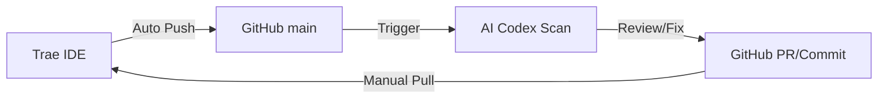

# Trae-GitHub-Codex Workflow Design

이 문서는 Trae IDE, GitHub, 그리고 AI(Codex 역할)를 연동한 실시간 코드 개선 및 자동화 워크플로우를 설명합니다.

## 1. 워크플로우 루프 (The Loop)

1.  **Trae IDE**: 사용자의 요청에 따라 코드를 작성하고 수정합니다.
2.  **GitHub**: 수정된 코드가 `sync-to-github.ps1`을 통해 실시간으로 업로드됩니다.
3.  **AI Codex (GitHub Actions)**: 업로드된 코드를 AI가 스캔하여 오류 수정, 병목 현상 제거, 성능 최적화 제안을 남깁니다.
4.  **Local Sync**: 사용자는 AI의 제안을 확인하고 `git pull`을 통해 로컬 환경에 반영합니다.

## 2. 브랜치 전략 (Branch Strategy)

-   `main`: 프로덕션 코드 및 AI 분석이 이루어지는 기본 브랜치입니다.
-   `feature/*`: 대규모 기능 개발 시 사용하며, `main`으로 머지 시 AI 리뷰가 실행됩니다.

## 3. 안전장치 (Safety Measures)

-   **Commit Message**: 모든 자동 업로드에는 타임스탬프와 함께 명확한 메시지가 포함됩니다.
-   **Review Before Merge**: AI가 직접 코드를 수정하는 경우, 반드시 Pull Request를 통해 사람이 검토한 후 머지합니다.

## 4. 도입 단계 (MVP Road Map)

1.  **1단계 (완료)**: GitHub 연동 및 자동 Push 스크립트 구축.
2.  **2단계 (완료)**: GitHub Actions를 이용한 AI 코드 리뷰 자동화.
3.  **3단계 (진행 중)**: AI 자동 수정 제안 및 로컬 반영 최적화.

---
*Last Updated: 2026-02-13*
